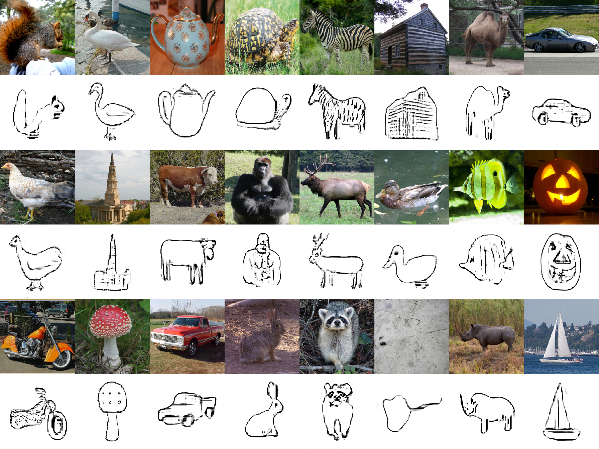

This repository provides the code for the WACV20 paper *Synthesizing human-like sketches from natural images using a conditional convolutional decoder*.




### Setting up the environment

The repo runs with the included `requirements.txt`.

### Pretrained Models

Download pretrained models from [here](https://drive.google.com/open?id=1m1DbK6WrlcKdN8r3wRPBi842IXPfTkhh) and put them in folder `pretrained_models`

### Testing on a single image

After downloading the pretrained models, simply run `python test.py --img_path <path-to-image> --label <label-of-image>`. See `python test.py --help` for the list of parameters.


### Training

First download the data and make sure you have the pretrained models `resnet_classifier.pt` and `PSim_alexnet.pt` downloaded inside `pretrained_models`.

#### Data preparation

Download the sketchy database from http://sketchy.eye.gatech.edu/. Get both the *Sketches and Photos* as well as the *Annotation and Info*.

Unpack into the following structure:
```
+-- data/
|   +-- photo/
|   +-- sketch/
|   +-- info/
```

#### Run the training

For training your own network simply run `python train.py`, it runs with default parameters. See `python train.py --help` for the list of parameters. The training script outputs to `stdout` and generates logfiles as well as tensorboard output.

### Citation

If you use anything from this work for your own, please cite

```
@inproceedings{kampelmuehler2020synthesizing,
  title={Synthesizing human-like sketches from natural images using a conditional convolutional decoder},
  author={Kampelm{\"u}hler, Moritz and Pinz, Axel},
  booktitle={IEEE Winter Conference on Applications of Computer Vision (WACV)},
  year={2020}
}
```